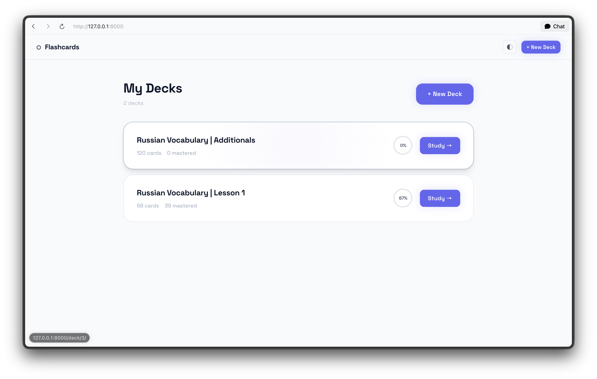
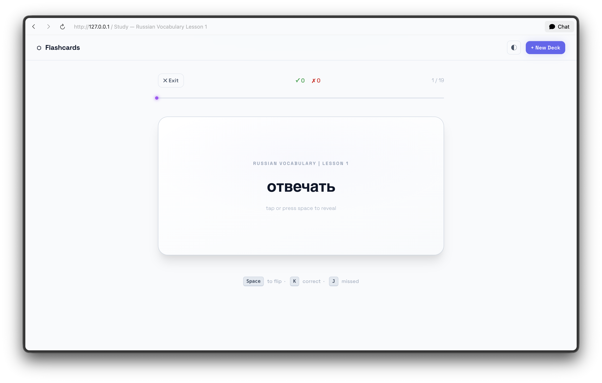
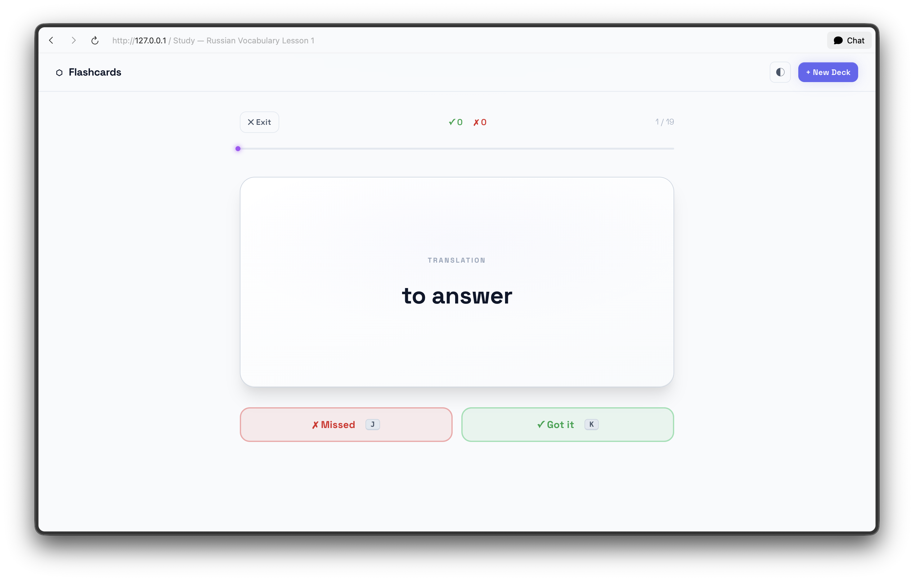

# Flashcards App

A modern, minimalist flashcard application built with Django, designed for efficient vocabulary learning. Inspired by the **"Not Boring Software"** aesthetic, it features an interactive, game-like interface with satisfying animations and keyboard-driven study sessions.

## 🚀 Key Features

- **"Not Boring" UI:** High-contrast design, smooth transitions, and a focus on interactive satisfaction using **Space Grotesk** typography.
- **Spaced Repetition Lite:** Cards are "mastered" after a streak of 3 correct answers, keeping your focus on what you haven't learned yet.
- **Smart Queueing:** Missed cards are automatically re-queued at the end of the session to reinforce learning until you get them right.
- **Bi-directional Learning:** The app randomly flips cards during study sessions to ensure you learn both directions (e.g., word to translation and translation to word).
- **CSV Import:** Quickly bootstrap your decks by importing cards from CSV files with support for BOM (Excel) and header detection.
- **Progress Tracking:** Monitor your mastery and accuracy for each deck with visual progress indicators.
- **Dark Mode:** Native dark and light mode support for comfortable study in any environment.
- **Keyboard Shortcuts:**
    - `Space`: Flip card
    - `K`: Mark as **Correct** / Got it
    - `J`: Mark as **Missed**

## 📸 Screenshots

| Main Deck List | Study Session (Front) | Study Session (Back) |
| :---: | :---: | :---: |
|  |  |  |

## 🛠 Tech Stack

- **Framework:** Django 6.0
- **Database:** SQLite (default), with `dj-database-url` support.
- **Frontend:** HTML5, CSS3 (Modern Vanilla CSS), Vanilla JavaScript.
- **Static Files:** WhiteNoise for efficient serving.

## ⚙️ Getting Started

### Prerequisites
- Python 3.10+
- pip

### Installation

1. **Clone the repository:**
   ```bash
   git clone <https://github.com/java-rakhmonaliev/flashcards.git>
   cd flashcard
   ```

2. **Create and activate a virtual environment:**
   ```bash
   python -m venv .venv
   source .venv/bin/activate  # On Windows: .venv\Scripts\activate
   ```

3. **Install dependencies:**
   ```bash
   pip install -r requirements.txt
   ```

4. **Run migrations:**
   ```bash
   python manage.py migrate
   ```

5. **Start the development server:**
   ```bash
   python manage.py runserver
   ```

6. **Access the app:**
   Open your browser and navigate to `http://127.0.0.1:8000/`.

## 📖 Usage

- **Create a Deck:** Use the "+ New Deck" button on the dashboard to create a category for your cards.
- **Add Cards:** Navigate to a deck and use the "Add Card" tab.
- **Importing CSV:** 
  - Prepare a CSV with two columns: `front` and `back`.
  - The first row is automatically skipped if it contains headers like "front", "word", or "question".
- **Study:** Click "Study" on any deck to begin. Use keyboard shortcuts (`Space`, `K`, `J`) for the fastest experience.
- **Mastery:** A card is considered "mastered" once you achieve a streak of 3 correct answers. Mastered cards are excluded from future sessions unless the deck progress is reset.
